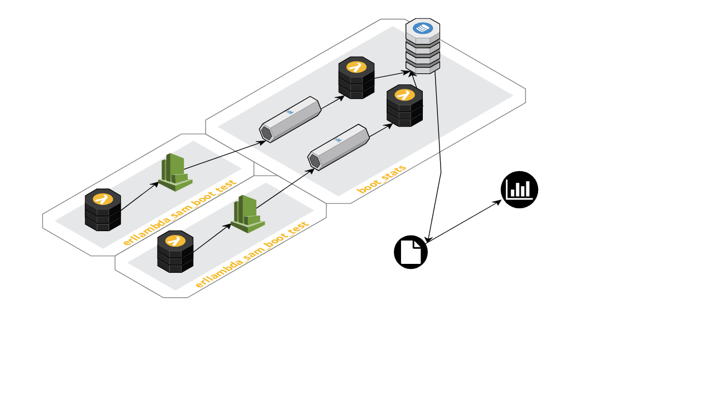

boot_stats
==========

AWS Lambda function that parses cloud watch logs and inserts stats
into dynamodb table for further processing.

## Overview

This AWS CloudFormation stack works together with
[erllambda_sam_boot_test](https://github.com/velimir/erllambda_sam_boot_test) stack.

`boot_stats` stack deploys Kinesis stream and lambda function for each code loading mode
(interactive or embedded). CloudWatch logs accepted from [lambda function](https://github.com/velimir/erllambda_sam_boot_test)
are forwarded to the Kinesis streams which are then processed by `boot_stats` function to extract
execution/boot time and store the stats into dynamodb table.

Repository contains some utilities to help analyse collected stats:

* `dump_table.py` export stats from a provided table in CSV format (see [stats.csv](etc/stats.csv) for an example)
* `execution time.ipynb` little jupyter notebook to help with understanding of collected data.

## Usage

### Build and Deploy stack

Build lambda function as it's described in [rebar3 erllambda plugin](https://github.com/alertlogic/rebar3_erllambda).

### Run tests

Using [erllambda_sam_boot_test](https://github.com/velimir/erllambda_sam_boot_test) repository
generate stats by performing deploy/invoke/destroy cycle.

### Export collected data

You can use `dump_table.py` script to export table in CSV format:

    ./etc/dump_table.py boot-stats-StatsTable-1C1QDZ2L4ZYMQ > ./etc/stats.csv

For further analysis you can use [jupyter notebook](etc/execution%20time.ipynb) to load and visualise exported data
